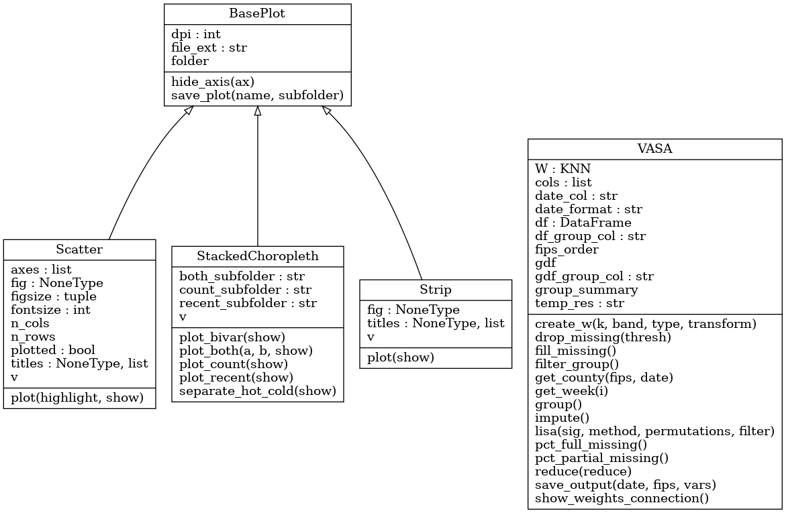
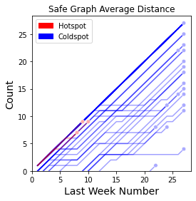

# VASA

The developed Python package, named VASA, will be accessible at https://github.com/move-ucsb/VASA. To demonstrate the applicability of the designed visualizations, the variability in spatiotemporal structure of human mobility patterns during the COVID-19 pandemic in the United States is assessed. VASA offers three novel multivariate visualizations: A stacked recency and consistency map, a line-path scatter plot, and a categorical strip (dot) plot. All three techniques use LISA as the base and utilize local Moran’s I and permuted p-values. The techniques are best suited for analysis of areal data at two levels of analysis: the object-level and the summary-level. The object-level of analysis receives the data at the finest available scale (e.g. county, census blocks, etc.), whereas the summary-level (e.g. state) refers to the less granular spatial units that contain object-level units. The stacked recency and consistency map allows to ascertain the spatiotemporal structure of data at both object- and summary-level. The categorical strip plot allows for comparison of trends at the summary-level. The line-path visualization is better suited for a fine-detail analysis of individual object-level trajectories within a specified summary-level.

